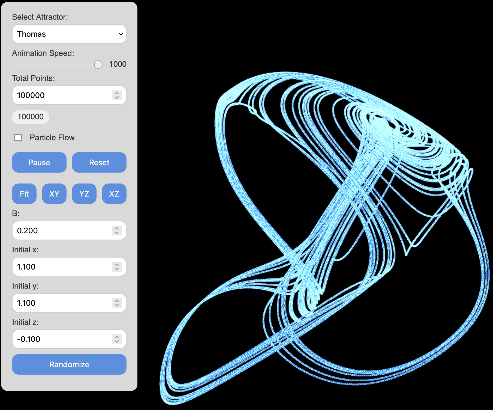
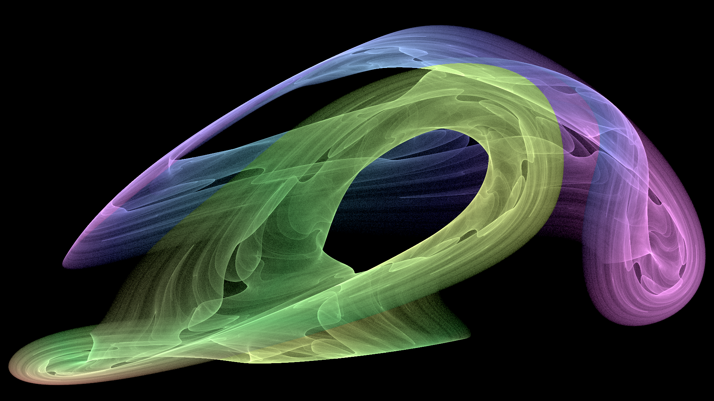
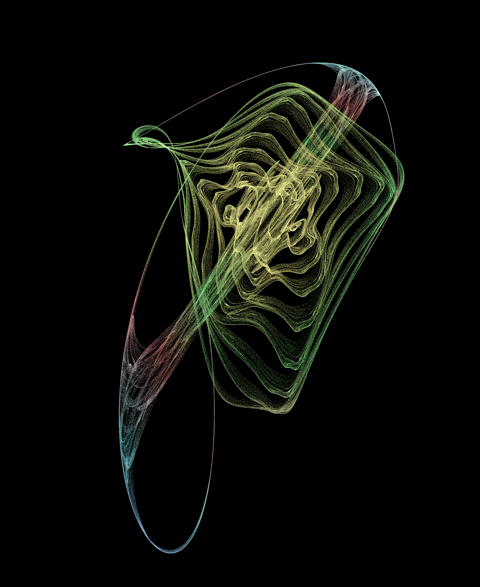

# Strange attractors

This repository explores the visualization of strange attractors, mathematical structures that exhibit chaotic behavior. The project implements attractor rendering using multiple programming languages, primarily Processing and R.

#### Implemented Languages
- [Processing](https://processing.org/): A flexible software sketchbook ideal for visual arts and computational design.
- [WebGL](https://developer.mozilla.org/en-US/docs/Web/API/WebGL_API): A JavaScript API for rendering high-performance interactive 2D and 3D graphics within browser

## Getting Started
1. Clone the repository:
```bash
git clone https://github.com/thibautbaissac/strange-attractors.git
cd strange-attractors
```
2. Run the Processing sketches:
- Open a .pde file in Processing.
- Click the ▶️ Run button to render the attractor.

## Implemented Attractors
#### WebGL
Explore and experiment with the WebGL version live in your browser: [here!](https://rawcdn.githack.com/ThibautBaissac/strange-attractors/refs/heads/main/src/webgl/index.html)
- Arneodo
- Bouali
- Bruke-Shaw
- Chen
- Dadras
- Fourwing
- Halvorsen
- Lorenz
- Rabinovich-Fabrikant
- Rössler
- Thomas
- Sprott


#### Processing
##### Polynomial strange attractors
This **Processing** sketch simulates two different strange attractors using a polynomial function approach.

1.  Poisson-Saturne Attractor
A complex chaotic structure generated using a polynomial function with tuned coefficients. It exhibits swirling, layered formations reminiscent of Saturn's rings or Poisson distributions in statistical modeling.


2.  Solar-Sail Attractor
A chaotic attractor with a flowing, dynamic shape resembling solar sail propulsion dynamics, with orbits that fan out like light-driven trajectories.


###### To switch between them, locate line at the top of the settings tab:
```java
final AttractorType CURRENT_TYPE = AttractorType.POISSON_SATURNE;
```
and replace the attractor type with the desired one:
```java
final AttractorType CURRENT_TYPE = AttractorType.SOLAR_SAIL;
```

###### Adjusting Simulation Parameters:
Each attractor has its own set of parameters stored in two functions:
```java
    getPoissonSaturneSettings()
    getSolarSailSettings()
```
Inside each function, you can change:
```java
int w = 1920;  // Width of canvas
int h = 1080;  // Height of canvas
int iterations = 100_000_000;  // Number of iterations to compute; higher values = more detail but longer processing time.
int chunkSize = 10_000;  // Number of iterations processed per frame
float scaleFactor = 1.0;  // Scaling factor for attractor visualization
float viewAngle = 5.5;  // Camera viewing angle
float halfDivisor = 2.0;  // Affects vertical scaling
```

###### Saving the Generated Image:
Once the attractor is fully rendered, press: `s`
This saves the attractor as `strange_attractor.png` in the sketch folder.

*🔗 Full credits for initial implementation in Rust goes to: [
https://github.com/Icelk/strange-attractor-renderer](https://github.com/Icelk/strange-attractor-renderer)*

#### Rossler attractor
Check the Rossler attractor code: [here](src/rossler/main.pde)


---
### Future Improvements
- Implement more strange attractors.
- Add interactive controls for real-time visualization.
- Code refactoring and optimization.
- ...and more!

---
### License
GNU General Public License v3.0 (see [LICENSE](LICENSE))
